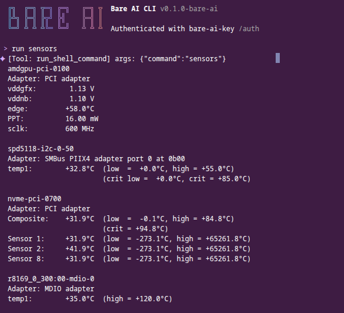

# 🛡️ Bare AI CLI

**A Fully Sovereign, Local, Agentic Terminal Assistant**

Bare AI CLI is an aggressively re-engineered fork of the Google Gemini CLI. It
strips out the hardcoded cloud dependencies and replaces them with a sovereign,
local-first agentic engine.

Designed to run in secure datacenter/homelab environments (like Proxmox) and
route through local inference engines (like Ollama), Bare AI CLI transforms a
standard conversational TUI into an autonomous Linux sysadmin capable of
executing shell commands, reading files, and diagnosing system issues in
real-time.

---

## ✨ Core Features

- **🔌 Universal OpenAI Compatibility:** A complete drop-in replacement
  (`BareAiClient`) for the Gemini backend, allowing the CLI to speak to any
  standard `/v1/chat/completions` endpoint (Ollama, vLLM, LM Studio, etc.).
- **🤖 Autonomous Agentic Loop:** The model isn't just a chatbot; it has active
  access to your system. It can autonomously use tools like `run_shell_command`,
  `read_file`, `write_file`, and `list_directory` to perform tasks, recover from
  its own errors, and summarize results.
- **🪶 Dynamic "Lean Mode" for Tiny Models:** Automatically detects models under
  8B parameters (e.g., `granite4:tiny-h`) and aggressively prunes tool schemas,
  drops optional parameters, and injects expanded `num_ctx` to prevent context
  window exhaustion.
- **📜 Constitution-Driven:** Agent identity and prime directives are loaded
  dynamically from a local markdown file (`~/.bare-ai/constitution.md`),
  ensuring the model stays in character and prioritizes tool execution.
- **🔐 Enterprise Security:** Out-of-the-box support for HashiCorp Vault
  (AppRole) to dynamically inject endpoint URLs, models, and API keys without
  leaving traces in bash history.
- **🐛 Persistent Diagnostic Tracing:** Bypasses TUI screen-clearing by writing
  raw JSON payloads, context token usage, and system states to a persistent
  `bare-ai-trace.log` file.
- **🔍 Sovereign Web Search:** Built-in web search via a self-hosted [SearXNG](https://searxng.github.io/searxng/) instance. Set `BARE_AI_SEARCH_URL` to route all searches through your own infrastructure with zero data leaving your network. Falls back to Google Search via Gemini API when unset.

---

## 🏗️ Architecture

Bare AI CLI works by intercepting the standard Google SDK calls within the CLI's
routing layer.

1. **The Intercept:** `BareAiClient` captures the prompt and active tool
   registry.
2. **The Translation:** It translates Google's `FunctionDeclarations` into
   standard OpenAI tool schemas, stripping bloat if "Lean Mode" is active.
3. **The Execution:** It POSTs to the local Ollama instance. If the model
   responds with `tool_calls`, the client executes the local bash/filesystem
   tool, captures the `stdout`/`stderr`, and feeds it back to the model.
4. **The Yield:** Once the model completes its reasoning loop, the final
   plain-text summary is yielded back to the beautiful Terminal UI.

---

## 🚀 Installation & Build

```bash
# Clone the repository
git clone [https://github.com/Cian-CloudIntCorp//bare-ai-cli.git](https://github.com/Cian-CloudIntCorp/bare-ai-cli.git)
cd bare-ai-cli

# Install dependencies and build the monorepo packages
npm install
npm run build && npm run bundle

⚙️ Configuration
Bare AI CLI is highly configurable via Environment Variables. These can be set manually, loaded via a .env file, or injected via the included sovereign.js Vault wrapper.

Core Variables
BARE_AI_ENDPOINT - The chat completions URL (Default: http://localhost:11434/v1/chat/completions)

BARE_AI_MODEL - The model string (e.g., granite4:tiny-h, llama3:8b)

BARE_AI_API_KEY - Optional bearer token (Default: none)

BARE_AI_CONSTITUTION - Absolute path to your system prompt markdown file.

BARE_AI_LEAN_TOOLS - Set to true to force strict tool pruning, or false to disable. (Auto-detects based on model name by default).

DEBUG_BARE_AI - Set to true to enable verbose output in bare-ai-trace.log.

Vault Integration (sovereign.js)
If using HashiCorp Vault to secure your datacenter endpoints:

Bash
export VAULT_ROLE_ID="your-approle-role-id"
export VAULT_SECRET_ID="your-approle-secret-id"
export VAULT_SECRET_PATH="secret/data/granite/config"
💻 Usage
Agentic Mode (Recommended)
Best used with capable local models like IBM Granite 4 (tiny-h) or Llama 3 (8B). The agent will execute shell commands and read files autonomously.

Bash
# Export your configuration or Vault credentials
export BARE_AI_CONSTITUTION="/home/user/.bare-ai/constitution.md"

# Launch the agent
node sovereign.js
Example Prompts:

"Ping 8.8.8.8 four times and report the latency."

"Check the systemd journal for the last hour and tell me why my Docker container crashed."

"Run a full network scan on my subnet and list active IPs."

Headless / Automation Mode
You can run the CLI in non-interactive mode using the --prompt (-p) flag, making it perfect for cron jobs and autonomous daily reporting.

Bash
node sovereign.js -p "Check disk space and CPU temperatures, then write a summary to ~/daily_report.md"
📝 License
This project is licensed under the Apache License 2.0. Originally forked from the Google Gemini CLI, modified and rewritten for local sovereignty by Cloud Integration Corporation.
```
